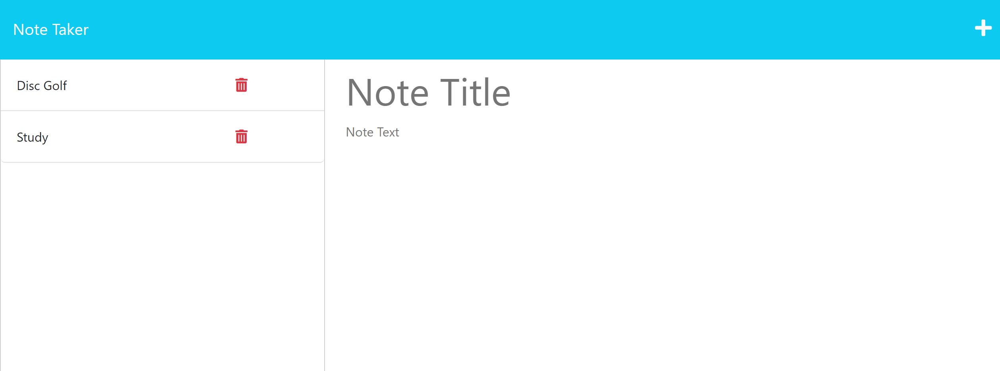

# note-take-express 

---
## Description
    
Program that utilizes express.js and shipped modules to take user inputs and display them as notes through modularized file paths. 

---    
## Table of Contents

+ **[Installation](#installation)**
+ **[Usage](#usage)**
+ **[License](#license)**
+ **[Contributing](#contributing)**
+ **[Tests](#tests)**

---  
## Installation
    
N/A

---    
## Usage
    
The reason behind the file is to display my ability to use express.js back end framework in tandem with shipped modules, front end js, css, and html to build a dynamic note taking application that stores user values in the application.

---    
## License
    
MIT

---
## Contributing
    
UDenver Bootcamp

---
## Tests
npm i
nodemon server.js

---
## Questions

**Contact Me:**
Email: [nick.m.fillip@gmail.com](nick.m.fillip@gmail.com)
Cell: (281) 216 - 2183
Github Profile: [https://github.com/nfillip](https://github.com/nfillip)

---

    

## Website
Github Repo: [https://github.com/nfillip/note-take-express.js](https://github.com/nfillip/note-take-express.js)
Heroku Repo:[https://note-take-express-js-8f46d967182f.herokuapp.com/](https://note-take-express-js-8f46d967182f.herokuapp.com/)
Heroku Deployed Site: [https://note-take-express-js-8f46d967182f.herokuapp.com/](https://note-take-express-js-8f46d967182f.herokuapp.com/)

---
© 2023 nfillip LLC. All Rights Reserved.